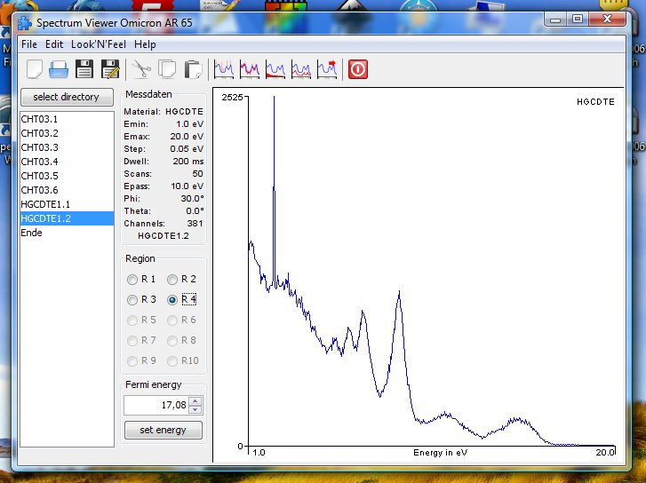

# AR65view

The Java-Program ar65view.jar is intended to analyze and manipulate the photo emission data measured by the ARPES experiments AR65 and WESPHOA. Both are part of the work group EES by Prof. Manzke at the Department of Physics, Humboldt University to Berlin, Germany. The program is written in Java 1.5 and runs therefore under Windows as well as Linux and Mac OS.

- 2007/11/27 Development started in October, this is the [first release v0.1.07.11](https://github.com/kreier/ar65view-svn/releases/tag/v0.1.07.11)
- 2011/02/01 Release r1 on SourceForge: [sourceforge.net/p/ar65view/code/1/](https://sourceforge.net/p/ar65view/code/1/)
- 2011/02/02 Release r13 on SourceForge: [r13](https://sourceforge.net/p/ar65view/code/13/) of the [project](https://sourceforge.net/projects/ar65view/) and its [website](https://ar65view.sourceforge.net/)
- 2018/10/08 Source code published on Github at [github.com/kreier/ar65view](https://github.com/kreier/ar65view) and [kreier.github.io/ar65view/](https://kreier.github.io/ar65view/)
- 2026/02/20 Copy of SourceForge SVN into Github: [github.com/kreier/ar65view-svn](https://github.com/kreier/ar65view-svn)

## Features

- Opens the *.1 files of EAC Software for Omicron AR65 files.
- Opens the EAC_STEP files with right energy from the same type of files (stepper motor program version).
- Opens the *.VIR files of the WESPHOA spectrometer.
- Detect and erase spikes from the spectra.
- Smoothing of the spectra, using the Savizky-Golay algorythm.
- Remove the 'Shirley background' from inelastic scattered electrons.
- Normalizing the peak height to a standard of 10000.
- Export of modified spectra data to clipboard.

## Known Bugs

If a certain file is selected in the `JList`, the selection of a different directory leads to an error message. (The `removeAktivation();` in `bin.SpectraData()` doesn't work ). FIX: Just restart the program.

## Release notes

### 0.1.07.10 (October 2007)
- First successful Java Version, developed in Moscow.
- Support of *.1 files of `EAC` Software for Omicron AR65 files.

### 0.1.07.12 (December 2007)
- Support of `EAC_STEP` files with right energy from the same type of files (stepper motor program version)
- Energy export to clipboard and Normalize to 10000 implemented.

### 0.1.08.04 (April 2008)
- Support of *.VIR files of the `WESPHOA` spectrometer.

### 0.2.11.01 (February 2011)
- 'Shirley background' can easily be removed (without negative data)
- Look and Feel finally works.
- Different language versions now solved by `PropertyResourceBundle`

### 0.2.11.02 (February 2011)
- Java webstart with JNLP added an new compiled, [sourcecode available](https://sourceforge.net/p/ar65view/code/HEAD/tree/) with SVN on [sourceforge](http://ar65view.sourceforge.net)

